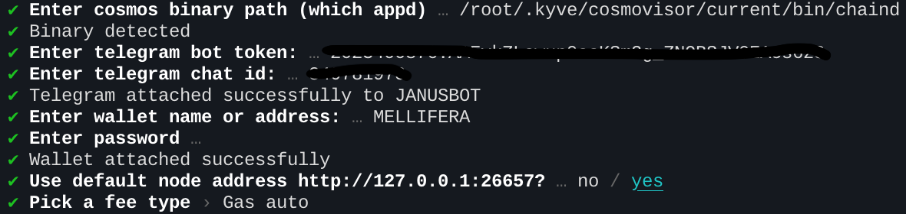

# janusbot
Self hosted Bot to easy vote in cosmos ecosystem


There is no need to vote via cli or web UI. just setup bot with your validator or wherever you want 
and get notifications with vote options  


## How to run a bot
### Upload the latest release on your machine 
For example:
```
wget https://github.com/MELLIFERA-Labs/janusbot/releases/download/v0.0.3/janusbot-linux-amd64
```

### Add binary to bin
```
 mv janusbot-linux-amd64 /usr/bin/janusbot 
```
### Setup app config
```
janusbot init
```
Fill all forms step by step as in example:



### Setup service file 
1. Create service file 
```
 touch /etc/systemd/system/janusbot.service
```
2. Fill service file:
```
cat <<EOF >> /etc/systemd/system/janusbot.service
[Unit]
Description=Janusbot daemon
After=network-online.target

[Service]
User=<USER>
ExecStart=/usr/bin/janusbot start
Restart=on-failure
RestartSec=3
LimitNOFILE=4096

[Install]
WantedBy=multi-user.target
EOF
```
3. Reload systemctl 
```
systemctl daemon-reload
```
4. Start service
```
 systemctl start janusbot.service
```
4. In order to watch the service run, you can do the following:
 ```
   journalctl -u janusbot.service -f
 ```
## SUPPORT US
- COSMOS: `cosmos1qcual5kgmw3gqc9q22hlp0aluc3t7rnsprewgy`
- JUNO: `juno1qcual5kgmw3gqc9q22hlp0aluc3t7rnsh3640c`
- OSMOSIS: `osmo1qcual5kgmw3gqc9q22hlp0aluc3t7rnsfc277k`

Also, you can just delegate in one of our nodes : )
https://mellifera.network
